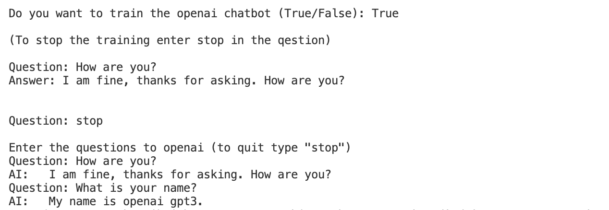

<h1> Openai GPT - 3 chatbot  &nbsp;  </h1>

---

This is a GPT 3 python project that allows you to train the chatbot and chat with it.

#### Requirements

> Openai key ( visit: [openai beta access](https://beta.openai.com) to get your api key)

> pip3 install openai

#### You can use this code as the skeleton for your project.

> Warning: `Use the tokens wisely, it is prefered to use davinci engine`

###

## Running the chatbot

> python3 GPT3-ChatBot.py

#### Download the code:

> git clone https://github.com/RohitPrajapat08/GPT3-Chatbot.git

> Change the variable **ai.api_key** to your api key .

#### Example(Output):

If you liked my project and appreciate the content I opensource, consider following me on github [🌥](https://github.com/reach-the-sky).
